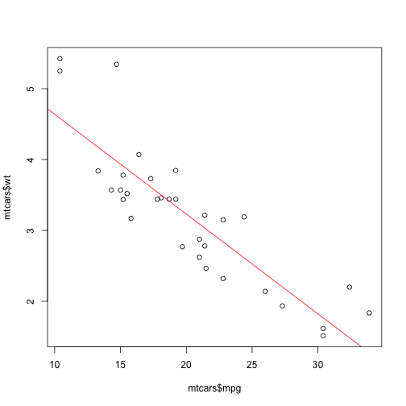

## Description

This course project uses data from the mtcars dataset from the R datasets library. It allows the user to interactively compare the relationship between two variables at a time by displaying a scatterplot, best-fit line, and resulting linear model.

---

## Dataset

### Motor Trend Car Road Tests

The data was extracted from the 1974 Motor Trend US magazine, and comprises fuel consumption and 10 aspects of automobile design and performance for 32 automobiles (1973–74 models).


```r
library(datasets)
head(mtcars)
```

```
##                    mpg cyl disp  hp drat    wt  qsec vs am gear carb
## Mazda RX4         21.0   6  160 110 3.90 2.620 16.46  0  1    4    4
## Mazda RX4 Wag     21.0   6  160 110 3.90 2.875 17.02  0  1    4    4
## Datsun 710        22.8   4  108  93 3.85 2.320 18.61  1  1    4    1
## Hornet 4 Drive    21.4   6  258 110 3.08 3.215 19.44  1  0    3    1
## Hornet Sportabout 18.7   8  360 175 3.15 3.440 17.02  0  0    3    2
## Valiant           18.1   6  225 105 2.76 3.460 20.22  1  0    3    1
```

---

## Variables

For the purposes of this project, only the following 6 continuous variables are allowed to be compared and plotted:

- Miles/(US) gallon
- Displacement (cu.in.)
- Gross horsepower
- Rear axle ratio
- Weight (lb/1000)
- 1/4 mile time

---

## Example Plot

Miles/(US) gallon vs. Weight (lb/1000) 

 

